# Research journey (Sep 2025 – Jun 2026)

One year of an undergraduate research project (NYCU EE, advisor Prof. 黃俊達, TA 陳泳翰) on
**prototype-based polyp segmentation**. The question throughout:

> Polyps and colon background are visually heterogeneous (flat vs. pedunculated, specular highlights,
> folds, shadows…). If the prediction head explicitly models several **sub-classes** per class with
> prototypes, does it capture this intra-class variance and segment better than a single linear head?

This document records what was tried, what happened, and — most importantly — *why* it happened.
Numbers are mDice (mean of five test sets) under one unified protocol; see [results.md](results.md) for protocol and
full tables.

```
 Fall 2025                                   Spring 2026
 ───────────────────────────────────────────────────────────────────────────────────────────►
 Sep–Oct      Nov            Dec          Mar             Mar–Apr        Apr–Jun
 SSL few-shot  3-stage        Learnable    DINOv3          Specialise     Non-learnable prototypes
 (ALPNet)      PVT+KMeans     prototype    backbone        easy/hard      V2 → V3 → V0 → Pseudo-label
 0.11          0.62–0.80*     0.865–0.876  0.785–0.870     0.864–0.874    0.838–0.869
                              ▲ TA's code base from here on (* = own eval script)
```

---

## Stage 0 — Self-supervised few-shot segmentation (Sep–Oct 2025) · `archive/0_ssl_fss`

**Idea.** Reproduce SSL-ALPNet (Ouyang et al., *TMI* 2022): generate superpixel pseudo-labels
(Felzenszwalb / SLIC / watershed) and train an adaptive-local-prototype network episodically, hoping the
superpixel supervision yields sub-regions inside polyps.

**Outcome.** Validation Dice 0.11. More fundamentally, the framework is *support-conditioned*: it
segments "the region that looks like the support mask". It cannot invent sub-classes that the
task never defines, and its low-resolution (32×32) prototype matching is a poor fit for fine
boundaries. → Dropped; kept the pseudo-label generators.

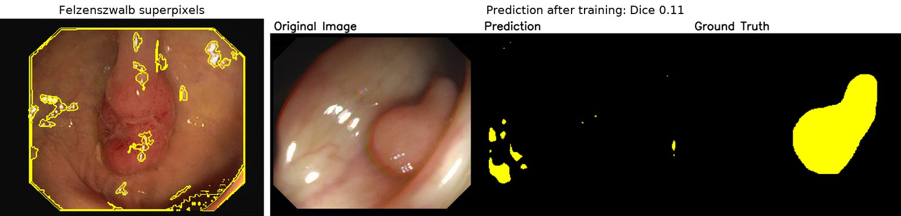
*Left: Felzenszwalb superpixels used as pseudo-labels — they follow specular highlights, not tissue. Right: the
trained model's prediction (Dice 0.11).*

## Stage 1 — Three-stage PVT + KMeans prototypes (Nov–Dec 2025) · `archive/1_pvt_kmeans`

Built from scratch (only the dataset was given).

1. **Global KMeans prototypes.** Cluster PVTv2 features into FG/BG centres offline, segment by cosine
   similarity. FG and BG centres reached cosine 0.9 → not separable. A per-image variant looked better
   but used the test GT to compute centres — *label leakage*, discarded once noticed.
2. **Three-stage pipeline.** (i) pixel-level contrastive pre-training (same coordinate under photometric
   augmentation), (ii) KMeans sub-labels (4 FG + 4 BG at 44×44) + sub-label contrastive loss,
   (iii) learnable prototypes + structure loss + sub-label CE. Dice 0.62–0.71; prototypes collapsed again
   in stage (iii).
3. Decoder swaps (EMCAD / CARA / ASPP) reached ~0.80 in this codebase, still below the TA baseline.

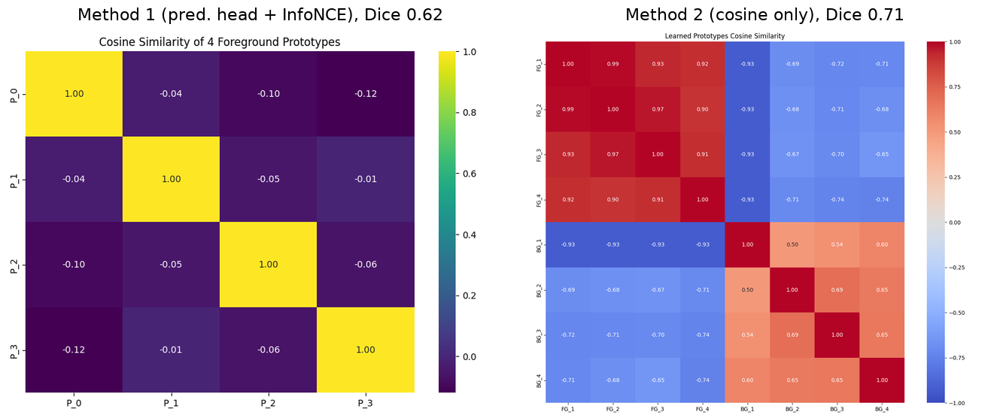
*Stage (iii), two prediction schemes. With a prediction head the random prototypes stay orthogonal — they carry
no meaning (Dice 0.62). Segmenting by cosine similarity alone, the four FG prototypes collapse to cos 0.90–0.99
(Dice 0.71).*

**Lesson.** Too many coupled components — when results fell short, the cause could not be isolated. The TA
provided their PVTv2 + EMCAD code, and every later experiment is a *minimal diff* on it.

## Stage 2 — Learnable prototype head (Dec 2025) · `configs/pvt_proto_*.yaml`

**Method.** Replace EMCAD's 1×1-conv head with K_fg + K_bg learnable 64-d prototypes. Prediction
= (max_k cos(f, p_fg,k) − max_k cos(f, p_bg,k)) × 10 → sigmoid, trained with the unchanged structure loss.
No pre-training, no auxiliary loss — an ablation-first restart.

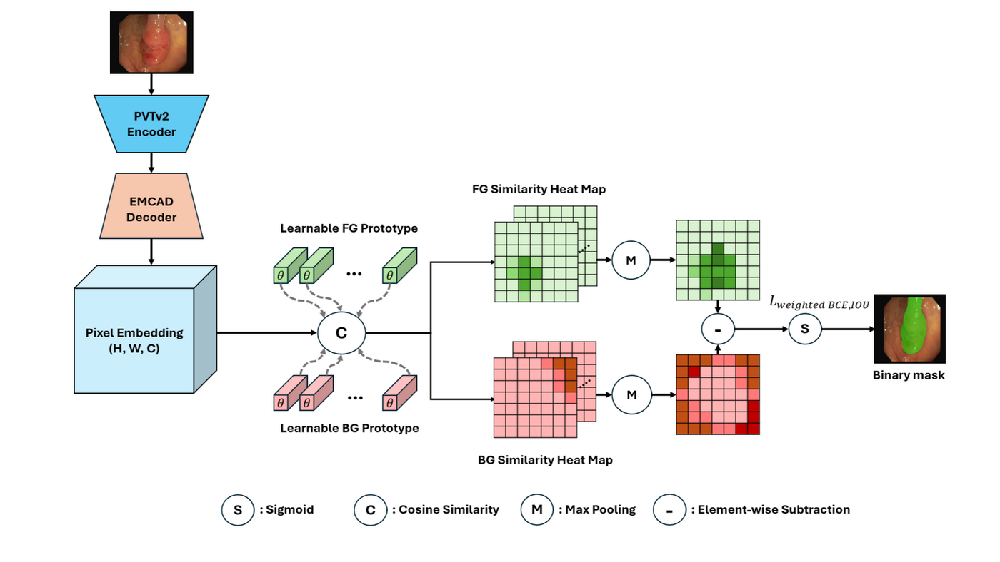

**Results.** 0.865–0.876 over 10 prototype counts; **fb88 = 0.876**, above EMCAD's published 0.866 — but my own
re-trains of the linear head reach 0.872 and 0.876, and a re-run of fb88 gave 0.866. The prototype head is *on par* with the linear head.

**Analysis.**
- Prototype similarity heatmaps: FG prototypes cluster, FG–BG prototypes diverge — they are not
  degenerate copies.
- Visualising argmax prototype per pixel shows a body/edge split (e.g. fb44: one prototype covers the
  polyp body, two others the rim).
- **Utilisation is extremely skewed**: in fb88 the top two prototypes win ~90% of pixels. On the
  hardest 20% of images utilisation is flatter — the minor prototypes act as a buffer for atypical samples.

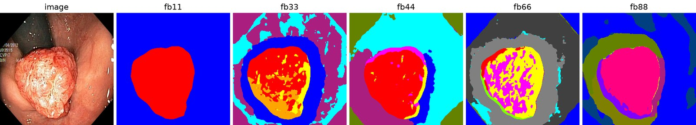
*Arg-max prototype per pixel on the same Kvasir image for 1–8 prototypes per class. Beyond fb11 the extra
prototypes split the polyp into body vs. rim and the background into rings around it.*

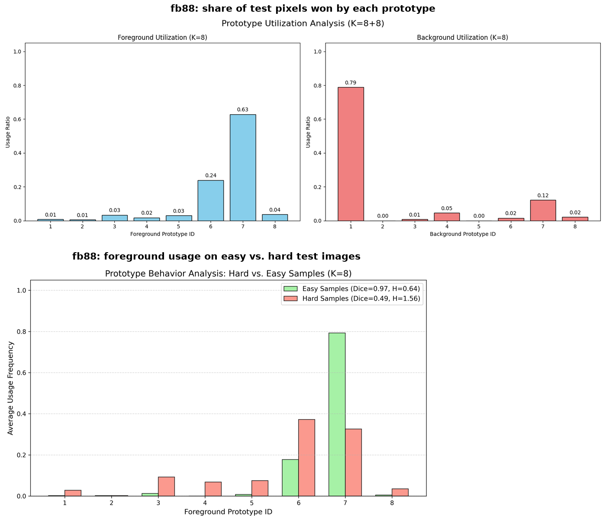

**KL balancing loss** (push per-class prototype usage toward uniform): utilisation became uniform,
masks became fragmented, mDice unchanged (0.863–0.870). *Balanced usage ≠ more semantics.*

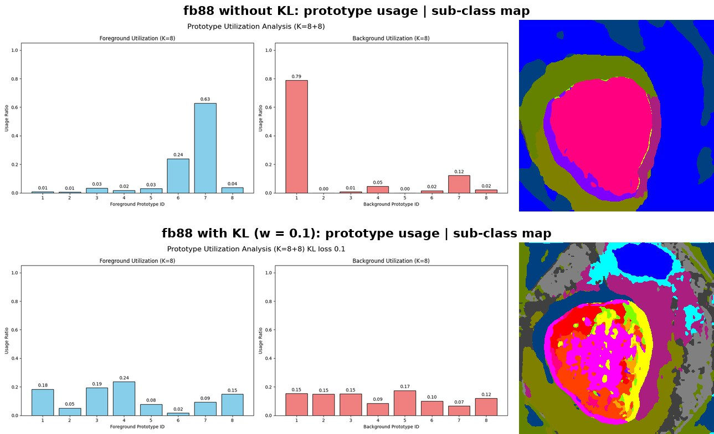

**Limitations identified.** (1) Results depend on a favourable random initialisation (fb88 did not reproduce:
0.866 on a re-run);
(2) gradient competition — the winning prototype takes both the pixels and the gradient, so
the other prototypes rarely recover.

## Stage 3 — DINOv3 backbone (Mar 2026) · `configs/dinov3_*.yaml`

**Why.** Self-supervised DINOv3 features should carry richer intra-class structure than a
supervised binary-trained encoder.

- Frozen DINOv3 + MLP: 0.785 (ViT-S+) / 0.799 (ViT-B) / 0.815 (ViT-L) — far below PVTv2 + EMCAD.
- Multi-layer concat (blocks 2, 4, …, 12) + full fine-tuning: 0.869 (MLP) / 0.870 (prototype fb44).
  ViT-S+ was kept as the main model for its PVTv2-b2-like parameter count.
- Prototype collapse became *stronger* with fine-tuning: FG prototypes of fb44 sit at cos 0.74–0.93 on a frozen
  backbone and 0.97–0.99 once the backbone is fine-tuned (BG likewise 0.97–0.98).

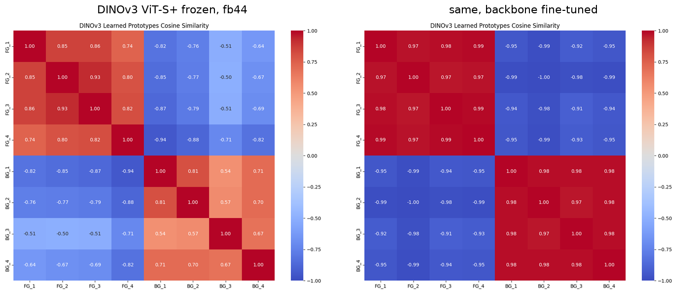

## Stage 4 — Prototype specialisation (Mar–Apr 2026) · `configs/*specialize*.yaml`

**Idea.** Accept the skew instead of fighting it: split FG prototypes into an *easy* and a *hard* set.
The hard set only acts as a residual where the easy set is unsure:

    s_fg = s_easy + (1 − σ(s_easy − s_bg)) · α · s_hard        (s_* = max cosine × learnable scale)

with α linearly warmed up over the first 10 epochs (`warm10`). Variants added an orthogonality loss,
an uncertainty gate, and a "hybrid" head whose prototypes are extracted from the image features.

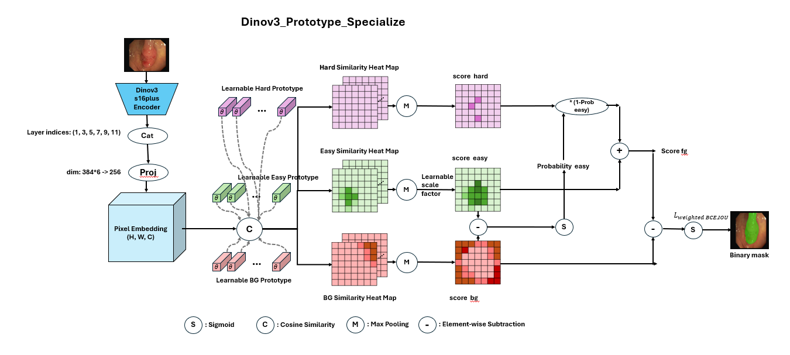

**Results.** 0.864–0.874 on PVTv2, 0.865–0.870 on DINOv3 — all inside the noise band. Worst-case
analysis showed both backbones struggle on the *same* ColonDB/ETIS images (Dice ≈ 0).

**Turning point.** The TA suggested analysing where the models break down before changing them further. This led to a literature survey (WPFormer; *Rethinking Semantic Segmentation: A Prototype View*,
Zhou et al., CVPR 2022 — "ProtoSeg").

## Stage 5 — Non-learnable prototypes (Apr–Jun 2026) · `protoseg_polyp/models/nonlearnable.py`

ProtoSeg's answer to gradient competition: prototypes are **not parameters**. Pixels of each class
are assigned to its M sub-prototypes by **Sinkhorn-Knopp** (a doubly-stochastic, balanced
assignment), prototypes are the **EMA** of their assigned, correctly-predicted pixels, and two
auxiliary losses shape the feature space — **PPC** (pixel–prototype contrastive, InfoNCE over all
sub-prototypes) and **PPD** (pixel–prototype distance).

| Version | Design | mDice | What we learned |
|---|---|---|---|
| **V2** | Prototypes on d1 (88×88, 64-d); init from structure-loss-pretrained weights + KMeans centres | 0.832–0.863 ‡ | Pretrained init helps the score, not the sub-classes |
| **V3** | *Dual level*: true prototypes on the most separable node (dd4, 11×11, 512-d, chosen by PCA), MLP-projected to d1 for segmentation; PPC on node, PPD on d1 | 0.869 (best at **epoch 2**); 0.856 from ImageNet init | One prototype absorbs almost all d1 pixels from step 1; the score is just the pretrained init |
| **V0** | Everything on d1, ImageNet init only | 0.845 | No collapse with PPC/PPD = 1, but FG splits into **concentric rings** and BG by brightness — a geometric, not semantic, decomposition |
| **Pseudo** | Prototypes become a *teacher*: Sinkhorn assignments are pseudo-labels for a K×M-way student head; binary output by log-sum-exp over sub-classes; CE + Dice | 0.857 | No collapse, no dead prototypes, good binary masks — but sub-class maps are salt-and-pepper |
| **Pseudo + superpixel** | Sinkhorn on GT-guided SLIC superpixel means (FG/BG run separately so no superpixel crosses the GT boundary) | 0.847 | Noise disappears, but the three background prototypes become **top / middle / bottom horizontal bands** (FG splits top/bottom too) — the partition follows vertical position, not tissue |

‡ V2: no checkpoint survived; scores as recorded in the spring report (original protocol).

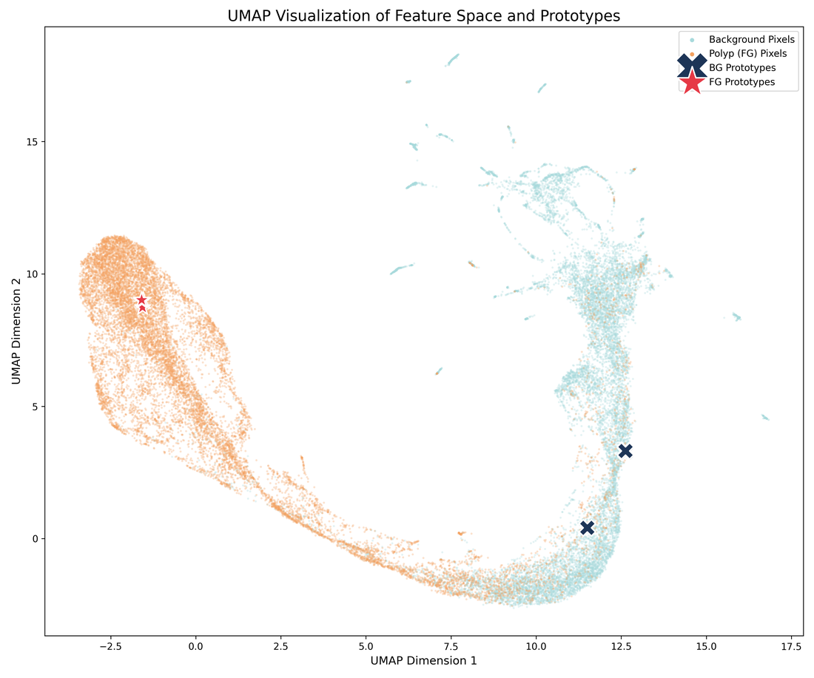
*V2 (pretrained init + KMeans): UMAP of d1 features. The five FG prototypes (stars) land on one point and the
BG prototypes on two: the polyp features form one blob with no sub-clusters to separate.*

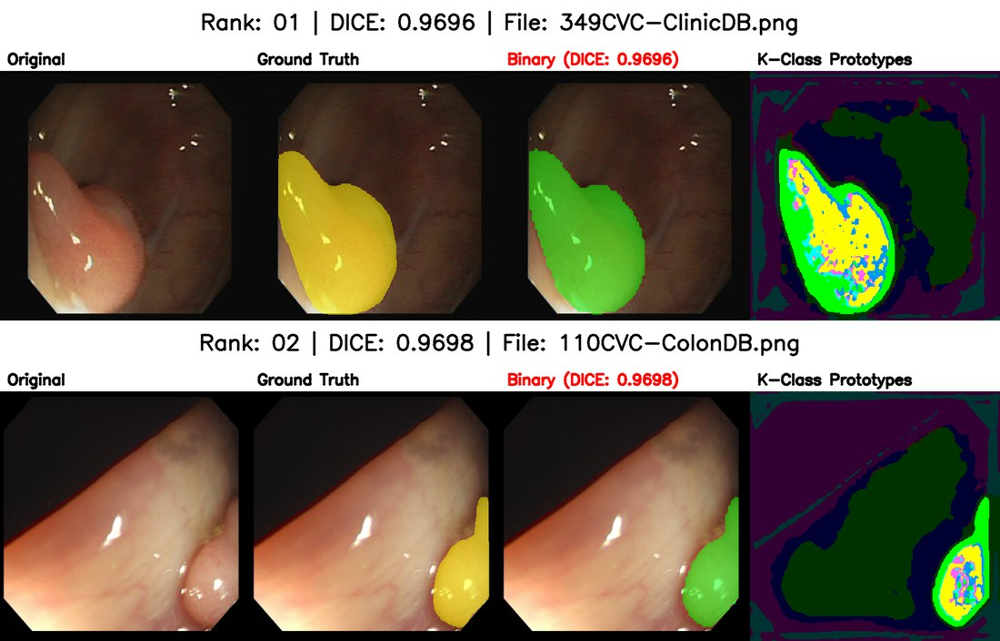
*V2 best cases: FG splits into rim vs. interior with scattered specular pixels, BG into a halo around the polyp
vs. the far wall — already the geometric pattern that every later version reproduced.*

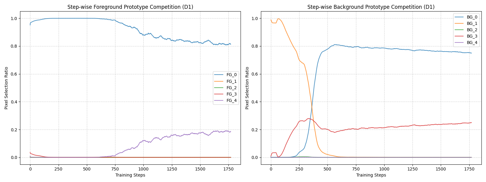
*V3 (pretrained init): one FG prototype wins ~100 % of foreground pixels from the very first steps; three of five
FG prototypes are never selected.*

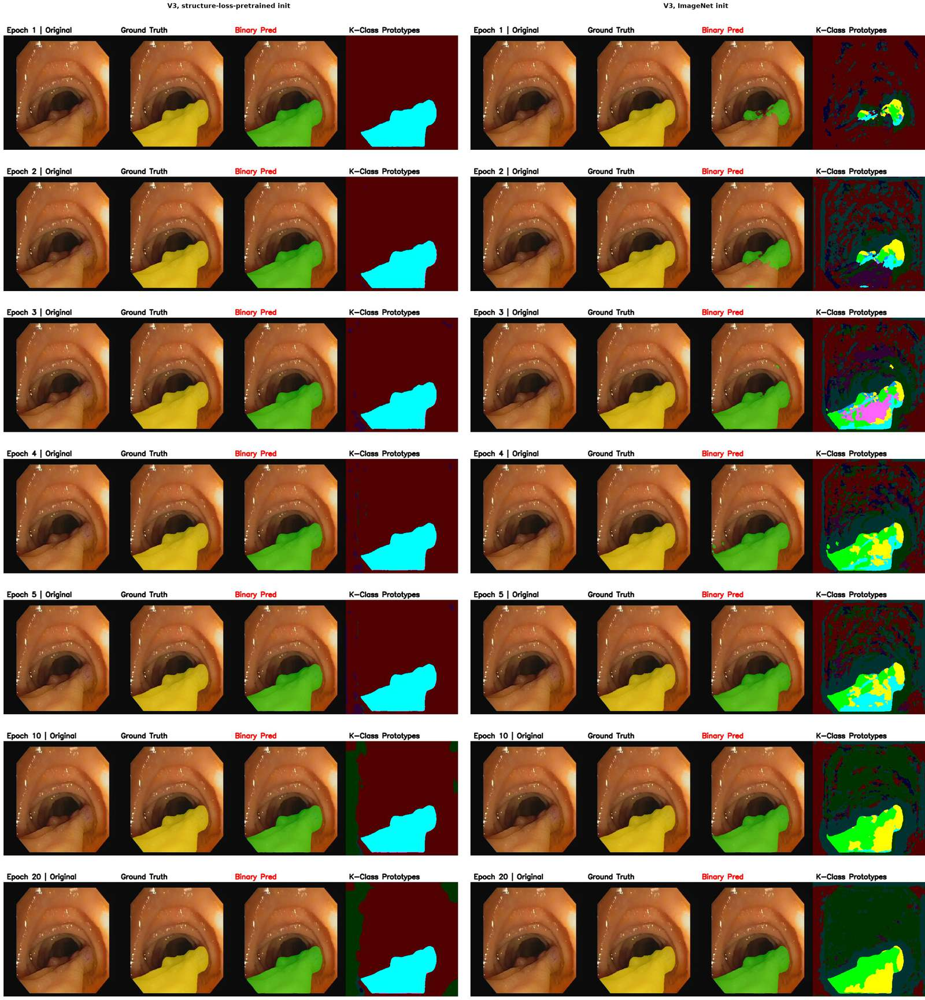
*V3 on one image across epochs 1–20. With the structure-loss-pretrained initialisation (left) the sub-class map
is binary from epoch 1; from ImageNet initialisation (right) several FG sub-classes appear early and shrink to
about two by epoch 20.*

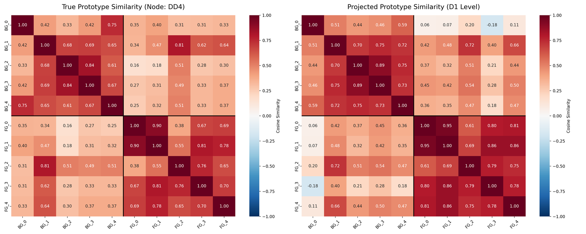
*V3 prototypes: cosine similarity among the true prototypes on dd4 (left) and after the MLP projection to d1
(right). The projection makes FG prototypes more alike (0.38–0.90 → 0.61–0.95).*

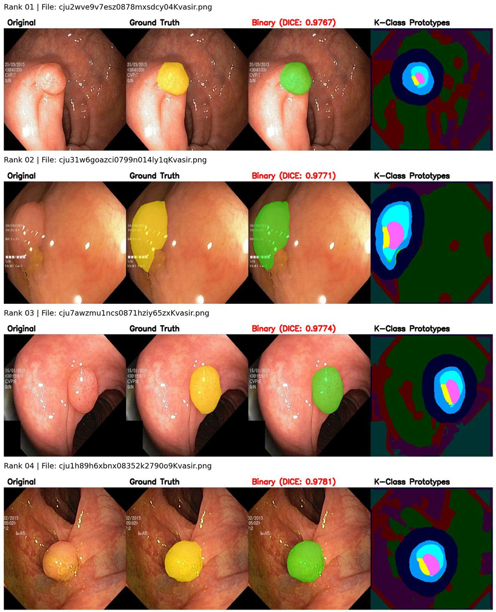
*V0 best cases: the FG sub-classes are concentric rings (outer / middle / core), the BG a dark halo plus the far
wall — the same layout on every image, independent of what the polyp looks like.*

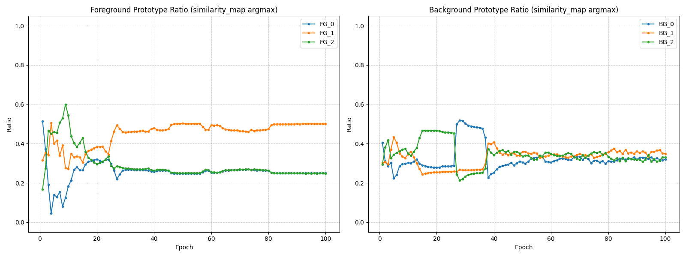
*Pseudo-label (fb33), share of pixels won by each sub-prototype per epoch. No prototype dies: after ~40 epochs the
BG shares settle near 1/3 each and FG at 0.50 / 0.25 / 0.25 — no collapse, yet balance alone says nothing about meaning.*

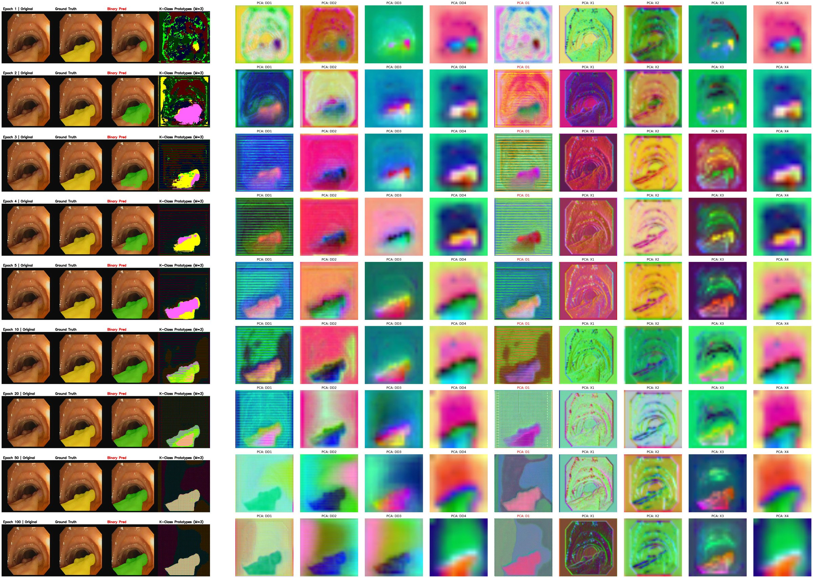
*…but the sub-class map (4th column) is salt-and-pepper early on and settles into stripes and blocks, not tissue types.*

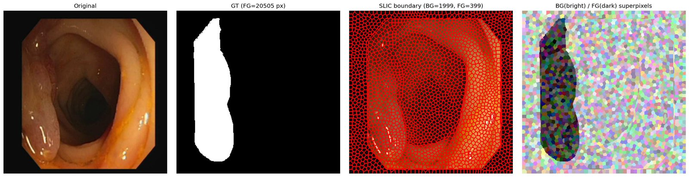
*GT-guided SLIC: superpixels computed separately inside the polyp and the background so none crosses the GT
boundary (at 352 × 352 — see note 6 below on their granularity).*

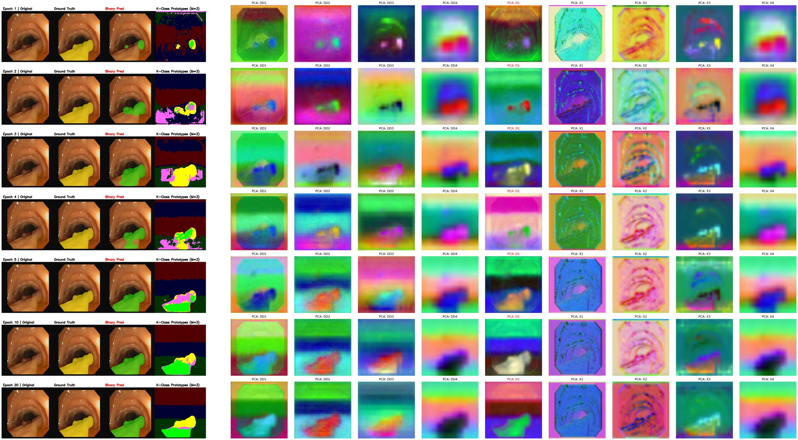
*Pseudo-label + superpixel, one image across epochs 1–20. Columns: image, GT, prediction, sub-class map, PCA of
each feature node. By epoch 3 the background sub-classes are horizontal bands, mirrored by vertical gradients in
the PCA of dd4 / x4: Sinkhorn found position, the only variation the binary-trained features carry.*

### Diagnosis: why the sub-classes stayed geometric

1. **Sinkhorn guarantees balance, not meaning.** Its uniform prototype-usage curve only proves the
   algorithm runs. When features carry no intra-class variation, a balanced assignment is arbitrary —
   and the easiest arbitrary split for a CNN/ViT is spatial (concentric rings, horizontal bands, brightness).
2. **PPC/PPD are alignment losses.** They amplify existing differences in feature space; they cannot
   inject new semantics. With an arbitrary assignment they form a closed loop: the model learns to
   predict its own random partition.
3. **Binary supervision dominates.** Structure loss rewards collapsing the class into one dense
   cluster; structure-loss pre-training makes d1 features binary from epoch 1.
4. **Implementation details that silently weakened the signal** — found during the analysis:
   node labels (11×11) nearest-upsampled to d1 (88×88) mislabel 8×8 blocks at every boundary (PPD
   ineffective); `amax` over prototypes sends gradient only to the winner; the MLP projector can map
   diverse node prototypes to one direction; `ignore_label = -1` never triggered.
5. **PPD temperature scaling (found during re-implementation).** V0/V3 multiply the contrast logits by a temperature
   of 10 for PPC, and the same scaled logits were fed to PPD, `(1 − 10·cos)²`. Its minimum is at
   cos = 0.1, so PPD pulled every pixel *away* from its assigned prototype, fighting PPC. ProtoSeg and
   V2 apply PPD to the raw cosine. The V0/V3 evidence is therefore confounded; the Pseudo-label
   variant (no PPD) reaches the same geometric decomposition, so the conclusion below still stands.
   `losses.ppd(legacy_scaled=True)` reproduces the old behaviour; V0 with the corrected PPD was re-run in the
   follow-up checks below.
6. **Superpixels were 16× finer than intended (found during re-implementation).** The superpixel count was meant as
   area / 50 *at d1 resolution* (the script's own help text: "2–120 FG superpixels"), but SLIC ran at 352×352, so
   an image has ≈2,400 superpixels — still ≈2,430 distinct ids after downsampling to d1 (88×88 = 7,744 pixels), i.e.
   ≈3 d1 pixels each. The "superpixel-level" Sinkhorn was therefore close to pixel-level. It still removed the
   salt-and-pepper noise; assignment at the intended granularity (`--pixels_per_sp 800` at 352 ≈ 50 d1
   pixels) was tested in the follow-up checks below.

### Follow-up checks (Sep 2026): do the two issues change the picture?

Four runs with `scripts/run_followup.sh`, each trained once and with the checkpoint selected on a 10 % validation
split. The layout statistics come from `tools/analyze_subclass_layout.py`, which uses the argmax of prototype
similarity over the FG channels on all 798 test images; all numbers are in
[results/subclass_layout.md](results/subclass_layout.md).

| Run | mDice | In-domain | Out-of-domain | FG sub-class layout |
|---|---|---|---|---|
| V0, original PPD | 0.844 | 0.916 | 0.797 | sectors by direction (large polyps: top / lower-left / lower-right) |
| V0, corrected PPD | 0.851 | 0.905 | 0.816 | **concentric rings**: median depth 0.17 / 0.45 / 0.52 (0 = rim, 1 = centre) |
| Pseudo + superpixel, 50 px (original) | 0.847 | 0.909 | 0.806 | horizontal bands |
| Pseudo + superpixel, 800 px (intended) | 0.842 | 0.908 | 0.798 | horizontal bands |

- **Scores.** Both fixes stay within run-to-run variation (+0.007 and −0.005), and both variants remain below the
  linear head.
- **Layout.** The partition still follows position:
  - With the corrected PPD, V0 draws rings.
  - The pseudo-label teacher looks image-level at first: in 67–72 % of test images, one FG sub-class takes more than
    90 % of the polyp (6–8 % for V0). But in the 111 large polyps (> 15 % of the image), the three FG sub-classes are
    ordered by height (median relative height 0.34 / 0.43 / 0.76) and all sit at the same width (≈ 0.5). The polyp is
    cut into the same horizontal bands as the background, and a small polyp simply falls into one band.
  - As a result, the winning sub-class tracks polyp size (Kruskal–Wallis p < 1e-15; median area 24 % vs. 3.5 % of
    the image) and not the source dataset (NMI ≤ 0.04).

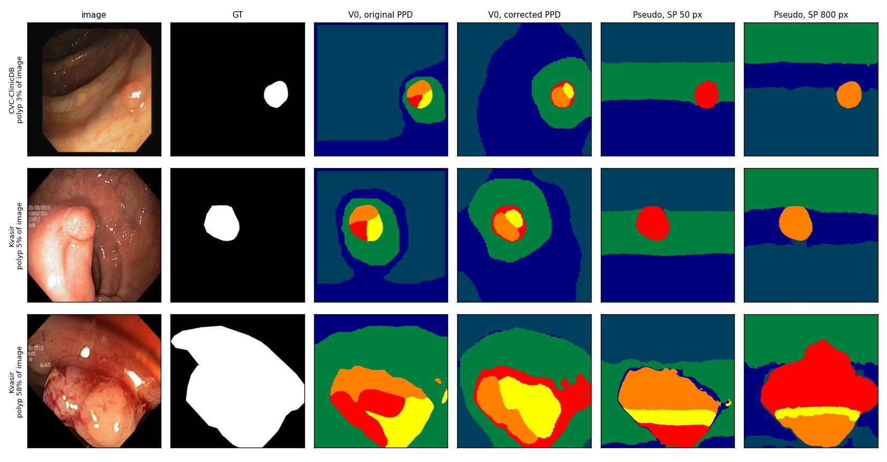
*Follow-up runs on a small, a medium and a large test polyp (validation-selected checkpoints). The PPD fix turns
sectors into rings, and coarser superpixels do not change the horizontal bands; a large polyp is split into the
same bands as the background.*

Coarser superpixels enlarge the unit of assignment, but Sinkhorn still balances regions *inside* images. To obtain
sub-classes that differ *between* polyps, the balanced unit would have to be the polyp itself.

**Conclusion.** *Binary supervision only defines the boundary between classes, never the structure
inside them.* A prototype head — learnable or not, pixel- or superpixel-level — can only partition
what the feature space already separates. The semantic signal has to come from outside the binary
labels. Supporting evidence: a labmate using **DINOv3 features** for SLIC + KMeans pseudo-labels with
full augmentation reached 0.88, while the same pipeline on binary-trained PVTv2 features did not.
With only 1,450 training images, learning such a self-supervised signal in-house is not feasible, so the
project concluded here; the natural continuation is to take sub-class structure from self-supervised or foundation-model
features and let the prototype head refine it.

## Lessons learned

- Establish run-to-run variance **before** comparing variants (three seeds of the baseline would have
  shown that ±0.01 is run-to-run variation and focused the later sweeps).
- Hold out a validation split instead of selecting checkpoints on the test sets.
- Instrument first (utilisation curves, per-step collapse, PCA of each decoder node), then design —
  the Stage 5 analysis tooling explained more in two weeks than Stage 4's model changes did in six.
